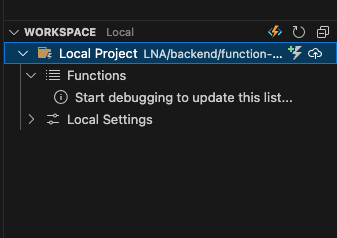

### How to get the wheel files
from lna-aggregators
```bash
poetry build
```
and then copy the .whl file you get into the vendor directory

### Run locally
from function-app: do it with the new version of lna_db if any.
``` bash
pip install --force-reinstall ./vendor/lna_aggregators-0.1.0-py3-none-any.whl
```

from function-app
``` bash
func start
```


### deploy
click the deploy button here in azure Extension


